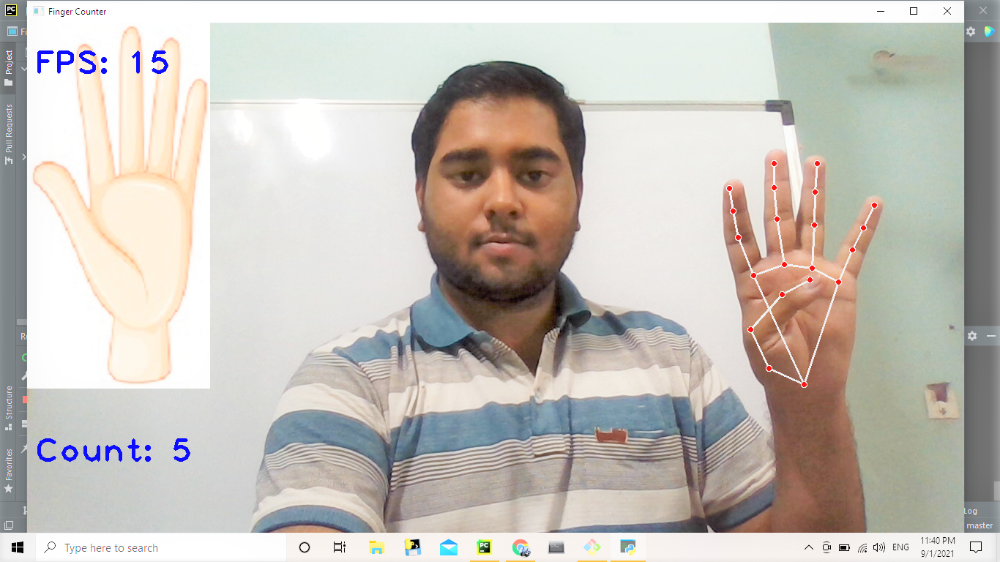

# CountingFingers

This project counts the number of fingers. With the help of mediapipe library, the detection of hand was done. The HandTrackingMin is minimum code written to detect the hand, which is further converted into module --> HandTrackingModule, for the code to be reusable.
The mediapipe gives us landmarks for each finger, which makes counting of fingers easy.
In the output, the count of finger, FPS and similar image of the count is displayed. The output image is as below:

